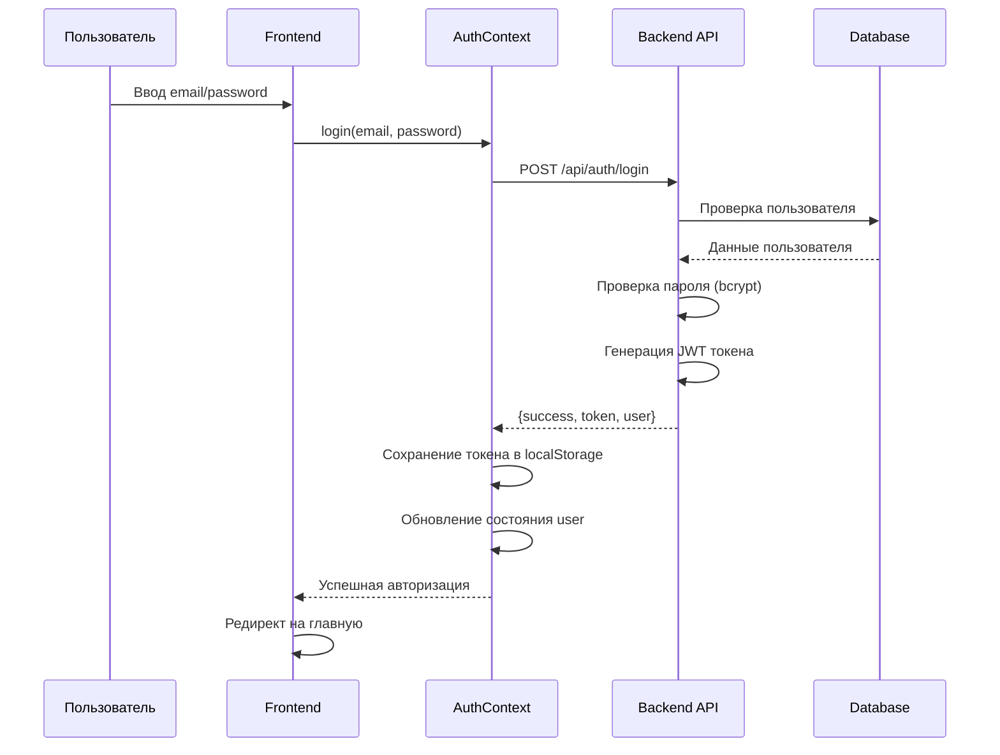
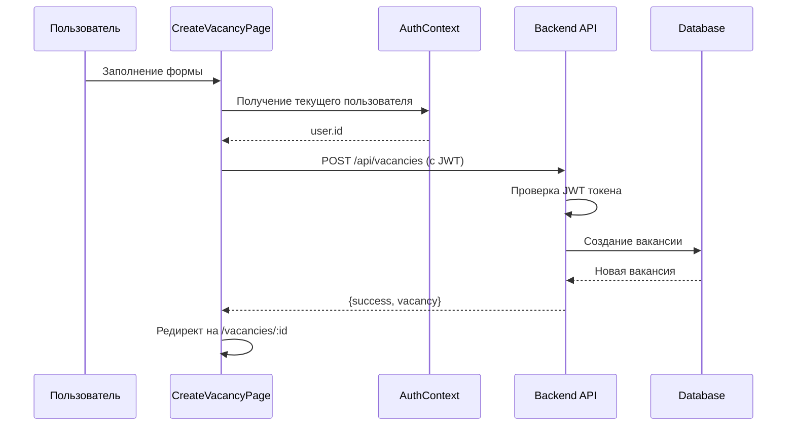

# Архитектура приложения sARA2

## Блок-схема работы приложения (Mind Map)

```mermaid
mindmap
  root((sARA2 Application))
    Frontend React
      Контексты
        AuthContext
          Аутентификация
          Авторизация
          Управление сессией
        ThemeContext
          Темная/Светлая тема
        NotificationContext
          Уведомления
          Реал-тайм обновления
      Страницы
        Публичные
          HomePage
          VacanciesPage
          PeoplePage
          ProfilePage
          VacancyDetailsPage
          SearchPage
          LoginPage
          RegistrationPage
        Защищенные
          CreateVacancyPage
            Regular
            Freelance
            Internship
            Creative
          EditProfilePage
          ConnectionsPage
          NotificationsPage
          SettingsPage
            Privacy
            Notifications
            Profile
          VacancyResponsesPage
          LogsMonitoringPage
      Компоненты
        Layout
          Header
          Footer
          MobileBottomNav
        UI
          Button
          Card
          Input
          Avatar
          Badge
          Tag
          Spinner
          Switch
        Бизнес-логика
          VacancyCard
          WorkExperienceSection
          WorkExperienceForm
          FriendsList
          AddFriendButton
          RecruiterInfo
        Визуализации
          CareerLadder
          ConnectionsSpiderChart
          ConnectionsSunburst
        Защита
          ProtectedRoute
      API Слой
        authAPI.js
        database.js
        peopleAPI.js
        registration.js
        services/api.js
      Hooks
        useApi
        useOptimizedApi
    Backend Express
      Middleware
        Helmet
          Безопасность
        CORS
          Cross-Origin
        Morgan
          Логирование
        Rate Limiting
          Защита от DDoS
        Body Parser
          JSON/URL-encoded
        Auth Middleware
          JWT проверка
      Роуты
        /api/auth
          POST /register
          POST /login
          GET /me
          POST /logout
        /api/users
          GET /
          GET /:id
          GET /me
          PUT /me
          GET /search
          GET /:id/vacancies
          GET /:id/connections
        /api/vacancies
          GET /
          GET /:id
          POST /
          PUT /:id
          DELETE /:id
          GET /:id/applications
        /api/connections
          GET /
          POST /
          PUT /:id
          DELETE /:id
        /api/applications
          GET /
          POST /
          PUT /:id
          DELETE /:id
        /api/notifications
          GET /
          PUT /:id/read
          DELETE /:id
        /api/work-experience
          GET /:userId
          POST /
          PUT /:id
          DELETE /:id
        /api/logs
          GET /
          GET /security
          GET /system
        /api/privacy
          GET /settings
          PUT /settings
        /api/settings
          GET /
          PUT /
        /api/user-skills
          GET /:userId
          POST /
          DELETE /:id
      Утилиты
        logger.js
          Системное логирование
          Безопасность логирования
          Пользовательское логирование
    База данных Prisma
      Модели пользователей
        User
          Основная информация
          Профиль
          Настройки
        UserSettings
          Уведомления
          Видимость профиля
        UserPrivacySettings
          Приватность профиля
          Настройки для друзей
        UserNotificationSettings
          Email уведомления
          Push уведомления
        UserProfileSettings
          Видимость
          Поиск
          Сообщения
        UserSkill
          Навыки пользователя
      Модели вакансий
        Vacancy
          Основная информация
          Тип вакансии
          Формат работы
          Стиль работы
        VacancyType
          Regular
          Freelance
          Internship
          Creative
        WorkFormat
          Офис
          Удаленно
          Гибрид
        WorkingStyle
          Полный день
          Неполный день
          Фиксированные часы
        VacancyField
          Связь с полями
        VacancySkill
          Связь с навыками
        VacancyOffer
          Предложения
        VacancyParticipant
          Участники
        VacancyPhoto
          Фотографии
      Модели связей
        Connection
          Друзья
          Статус связи
        FriendPrivacySettings
          Настройки приватности для друзей
      Модели заявок
        Application
          Заявки на вакансии
          Статус заявки
          Сопроводительное письмо
      Модели опыта
        WorkExperience
          Компания
          Должность
          Период работы
          Описание
      Модели уведомлений
        Notification
          Тип уведомления
          Статус прочтения
      Модели справочников
        Skill
          Навыки
        Field
          Поля деятельности
        Offer
          Предложения
        ParticipantReceive
          Что получает участник
      Модели логирования
        UserLog
          Действия пользователя
        SecurityLog
          Безопасность
        SystemLog
          Системные логи
      Модели миграций
        SchemaMigration
          Версии схемы
    Инфраструктура
      SQLite Database
        dev.db
      Prisma ORM
        Схема
        Миграции
        Seed данные
      Environment
        .env
        Переменные окружения
      Security
        JWT токены
        Bcrypt хеширование
        Helmet защита
        Rate limiting
```



## Детальная блок-схема взаимодействия компонентов

```mermaid
flowchart TD
    A[Пользователь] -->|HTTP Request| B[Express Server]
    B -->|Middleware| C{Аутентификация?}
    C -->|Да| D[Auth Middleware]
    C -->|Нет| E[Публичные роуты]
    D -->|JWT проверка| F[Роуты API]
    E --> F
    
    F --> G[Роуты]
    G --> H[/api/auth]
    G --> I[/api/users]
    G --> J[/api/vacancies]
    G --> K[/api/connections]
    G --> L[/api/applications]
    G --> M[/api/notifications]
    G --> N[/api/work-experience]
    G --> O[/api/logs]
    G --> P[/api/privacy]
    G --> Q[/api/settings]
    G --> R[/api/user-skills]
    
    H --> S[Prisma Client]
    I --> S
    J --> S
    K --> S
    L --> S
    M --> S
    N --> S
    O --> S
    P --> S
    Q --> S
    R --> S
    
    S --> T[(SQLite Database)]
    T -->|Данные| S
    S -->|Response| F
    F -->|JSON| B
    B -->|HTTP Response| A
    
    A -->|React App| U[Frontend]
    U --> V[React Router]
    V --> W[Pages]
    W --> X[Components]
    X --> Y[API Calls]
    Y -->|fetch/axios| B
    
    U --> Z[Contexts]
    Z --> AA[AuthContext]
    Z --> AB[ThemeContext]
    Z --> AC[NotificationContext]
    
    AA -->|Управление состоянием| W
    AB -->|Тема| X
    AC -->|Уведомления| W
```

## Поток данных при аутентификации



## Поток данных при создании вакансии



## Структура файлов проекта

```
sARA2/
├── client/                    # React Frontend
│   ├── src/
│   │   ├── api/              # API клиенты
│   │   ├── components/       # React компоненты
│   │   │   ├── auth/         # Компоненты аутентификации
│   │   │   ├── layout/       # Компоненты макета
│   │   │   ├── ui/           # UI компоненты
│   │   │   └── visualizations/ # Визуализации
│   │   ├── contexts/         # React Contexts
│   │   ├── hooks/            # Custom hooks
│   │   ├── pages/            # Страницы приложения
│   │   ├── services/         # Сервисы
│   │   └── styles/           # Стили
│   └── public/               # Статические файлы
├── routes/                   # Express роуты
│   ├── auth.js              # Аутентификация
│   ├── users.js             # Пользователи
│   ├── vacancies.js         # Вакансии
│   ├── connections.js       # Связи
│   ├── applications.js      # Заявки
│   ├── notifications.js     # Уведомления
│   ├── workExperience.js    # Опыт работы
│   ├── logs.js              # Логи
│   ├── privacy.js            # Приватность
│   ├── settings.js          # Настройки
│   └── userSkills.js        # Навыки пользователя
├── middleware/              # Express middleware
│   └── auth.js              # JWT проверка
├── prisma/                  # Prisma ORM
│   ├── schema.prisma        # Схема БД
│   ├── seed.js              # Seed данные
│   └── dev.db               # SQLite база данных
├── utils/                   # Утилиты
│   └── logger.js            # Логирование
└── server.js                # Express сервер
```

## Основные технологии

- **Frontend**: React 19, React Router, Framer Motion, Tailwind CSS
- **Backend**: Express.js, Node.js
- **Database**: SQLite с Prisma ORM
- **Authentication**: JWT (JSON Web Tokens), bcryptjs
- **Security**: Helmet, CORS, Rate Limiting
- **Logging**: Morgan, Custom Logger
- **Visualization**: Recharts

## Основные функции приложения

1. **Аутентификация и авторизация**
   - Регистрация пользователей
   - Вход в систему
   - Управление сессией через JWT

2. **Управление профилем**
   - Просмотр и редактирование профиля
   - Опыт работы
   - Навыки и интересы
   - Настройки приватности

3. **Вакансии**
   - Просмотр вакансий
   - Создание вакансий (Regular, Freelance, Internship, Creative)
   - Детали вакансии
   - Управление откликами

4. **Связи (Connections)**
   - Поиск людей
   - Отправка запросов на дружбу
   - Управление связями
   - Настройки приватности для друзей

5. **Уведомления**
   - Система уведомлений
   - Настройки уведомлений
   - Реал-тайм обновления

6. **Поиск**
   - Поиск пользователей
   - Поиск вакансий
   - Фильтрация результатов

7. **Логирование и мониторинг**
   - Логи пользователей
   - Логи безопасности
   - Системные логи
   - Мониторинг активности


